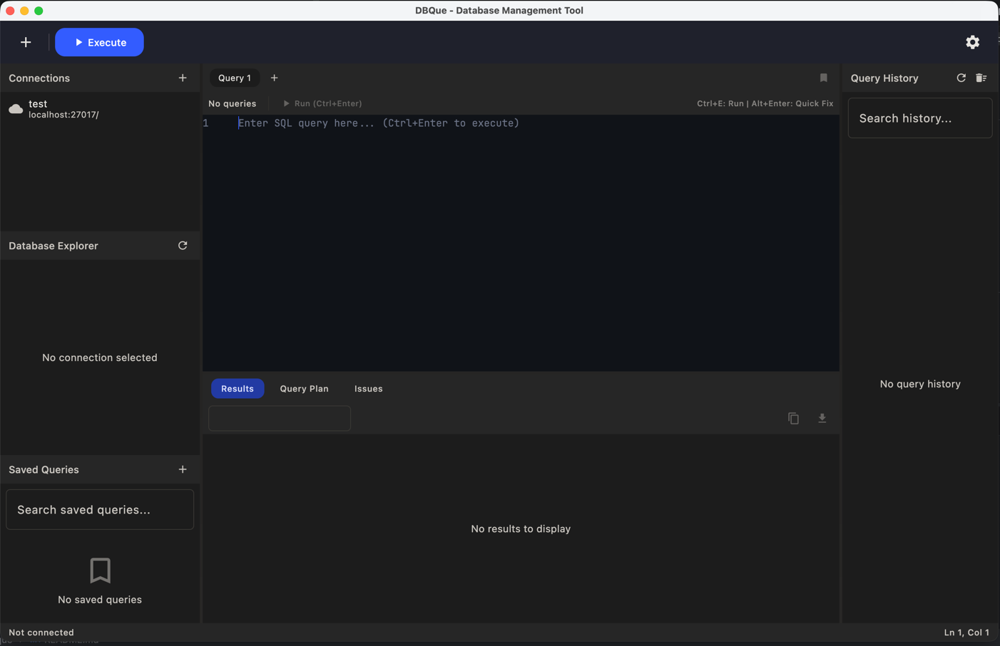

# DBQue

A modern, cross-platform database management tool built with Kotlin and Compose Multiplatform —
a single, intuitive workspace for PostgreSQL, MySQL, SQLite, H2, MongoDB, and Elasticsearch with
**context-aware query authoring**, live error detection, and in-place data editing.

[](LICENSE)
[](https://kotlinlang.org)
[](https://www.jetbrains.com/compose-multiplatform/)
[](#getting-started)

> **Status:** under active development. Multi-database connections, the SQL/NoSQL editor with
> completion and quick-fixes, schema explorer, results editing, and SSH tunneling are working;
> ER diagrams, visual schema design, and refactoring are on the roadmap.

---

<div align="center">
  
</div>

---

## Features

### Query editor
- Syntax highlighting for SQL, MongoDB, and Elasticsearch queries
- Context-aware, schema-aware auto-completion (tables, columns, keywords)
- Live error detection with inline diagnostics and one-click **quick-fixes**
- Query history with search, plus a saved-queries library
- Per-statement execution with `Cmd/Ctrl + Enter`

### Data & schema
- Sortable, filterable results grid with in-place cell editing
- Lazy-loaded schema explorer: tables, views, columns, indexes, and procedures
- Graphical query-plan visualization
- Data export to CSV, JSON, or SQL `INSERT` statements

### Connectivity
- Six engines from one app: **PostgreSQL, MySQL, SQLite, H2, MongoDB, Elasticsearch**
- HikariCP connection pooling
- SSH tunneling with password or private-key authentication

### Experience
- Dark / light, system-aware theming
- Native desktop packaging for macOS, Windows, and Linux

---

## Database support

| Database      | Version  | Status       |
|---------------|----------|--------------|
| PostgreSQL    | 9.3+     | Full support |
| MySQL         | 5.7+     | Full support |
| SQLite        | 3.x      | Full support |
| H2            | 2.x      | Full support |
| MongoDB       | 4.0+     | Full support |
| Elasticsearch | 7.x/8.x  | Full support |

---

## Tech stack

| Area | Technology |
|------|------------|
| Language | Kotlin 2.4.0 (JVM target 25) |
| UI | Compose Multiplatform 1.10.2 (Desktop) |
| Async | Kotlin Coroutines 1.11.0 |
| DI | Koin 4.2.1 |
| Serialization | kotlinx.serialization 1.11.0 |
| HTTP | Ktor 3.5.0 |
| Persistence | SQLDelight 2.2.1 |
| Connection pool | HikariCP |
| SQL parsing | better-parse |
| SSH | JSch |
| Build | Gradle 9 (Kotlin DSL, version catalog) |
| Quality | ktlint, all warnings as errors |

---

## Project structure

The codebase follows MVI and is organized by feature under a single Gradle module:

```
src/main/kotlin/su/kidoz/
├── App.kt          application entry point
├── core/           domain models and data repositories
├── database/       drivers, query execution, export formatters, SSH tunneling
├── feature/        connection, editor, explorer, history, parser,
│                   queryplan, results, savedqueries, settings
├── mvi/            MVI base classes (State / Event / Effect / ViewModel)
└── ui/             Compose UI components and theme
```

---

## Getting started

### Prerequisites
- **JDK 25** or later
- No separate Gradle install needed — use the included wrapper (`./gradlew`)

### Build & run

```bash
# Build the project (detekt is excluded — incompatible with Gradle 9)
./gradlew build -x detekt

# Run the desktop application
./gradlew run

# Create a native distribution for the current OS (DMG / MSI / DEB)
./gradlew packageDistributionForCurrentOS
```

### Testing & quality gates

```bash
# Run all tests
./gradlew test -x detekt

# Lint (warnings are treated as errors)
./gradlew ktlintCheck

# Auto-format
./gradlew ktlintFormat
```

---

## Usage

1. Click **Add Connection**, pick a database type, and enter host, port, database, and
   credentials — optionally configure an SSH tunnel, then **Test Connection** and **Save**.
2. Open a query tab, write SQL / MongoDB / Elasticsearch, and press `Cmd/Ctrl + Enter` to run.
   Detected issues appear in the **Issues** panel with quick-fixes.
3. To edit data, run a `SELECT` with a primary key, enable **Edit Mode**, double-click cells,
   and **Save Changes** to persist.

### Keyboard shortcuts

| Action          | macOS       | Windows/Linux |
|-----------------|-------------|---------------|
| Execute Query   | Cmd + Enter | Ctrl + Enter  |
| New Query Tab   | Cmd + T     | Ctrl + T      |
| Close Tab       | Cmd + W     | Ctrl + W      |
| Save Query      | Cmd + S     | Ctrl + S      |
| Settings        | Cmd + ,     | Ctrl + ,      |
| Toggle Comment  | Cmd + /     | Ctrl + /      |

### Configuration

Settings are stored in `~/Library/Application Support/DBQue/` (macOS),
`%APPDATA%/DBQue/` (Windows), or `~/.dbque/` (Linux).

---

## Architecture

- **MVI** (Model-View-Intent) for all UI state: immutable state, sealed events/effects,
  and `StateFlow`-based view models. Each feature ships `*State`, `*Event`, `*Effect`,
  and `*ViewModel` classes.
- **Driver abstraction**: each engine implements a common driver contract, so the editor,
  explorer, and results layers stay database-agnostic.
- **Pooled connections**: every database operation borrows from HikariCP via `.use {}` to
  guarantee connections are returned to the pool.
- **Pluggable parsing**: SQL, MongoDB, and Elasticsearch each have a dedicated parser feeding
  completion and live diagnostics.

---

## Roadmap

- [ ] ER diagram generator and visual schema editor
- [ ] SQL code formatting with style presets
- [ ] Symbol-aware refactoring (rename columns/tables with usage tracking)
- [ ] Snippet library and named parameter substitution
- [ ] Multi-cursor editing and code folding
- [ ] Additional engines (Oracle, SQL Server, ClickHouse)

---

## License

Released under the [MIT License](LICENSE).

Copyright (c) 2024 Aleksandr Pavlov &lt;ckidoz@gmail.com&gt;
